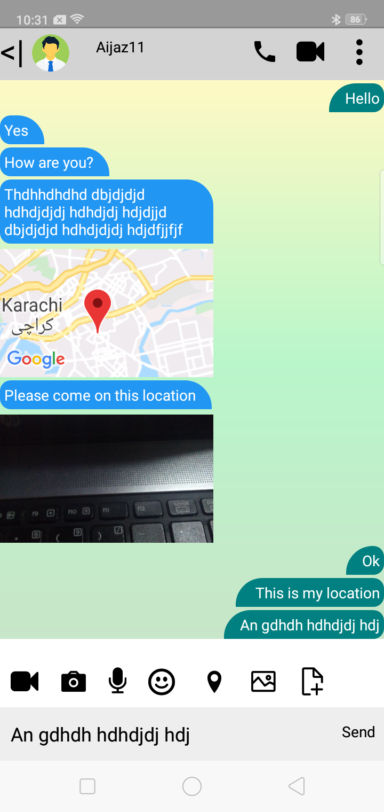
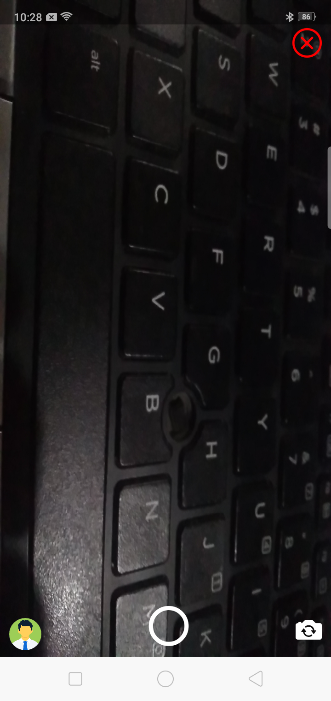
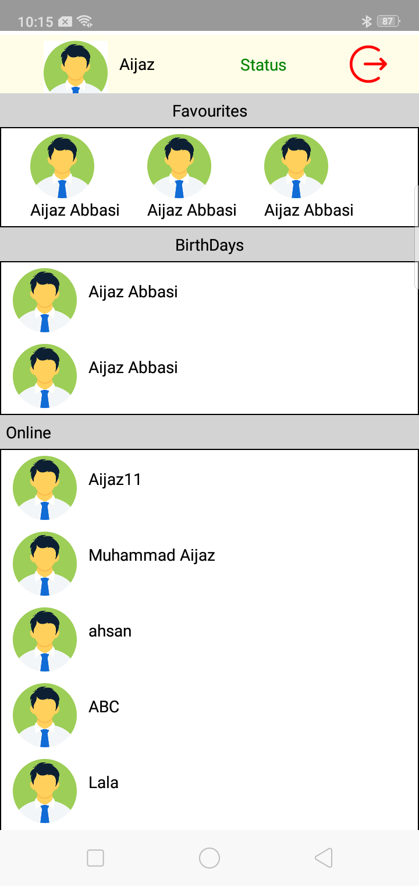
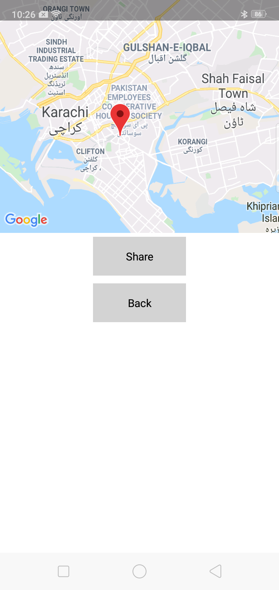
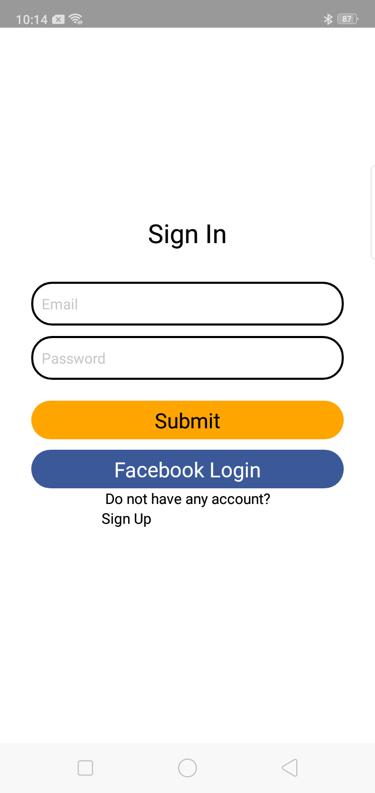
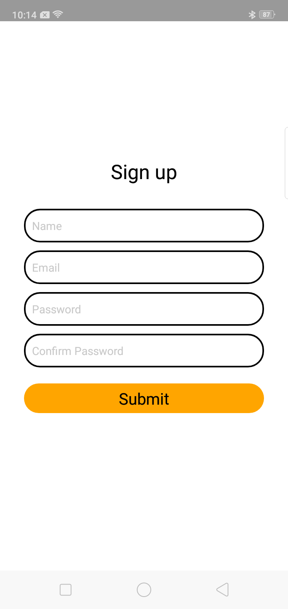

# React_Native_Chat_App
This chat app is created by using React Native expo and firebase. In this App user can send share text, video, location and picture and also can record voice.

# Some ScreenShots of the App
---

### 1.Chat Screen

### 2.Camera Screen

### 3.Dashboard Screen

### 4.Location Share Screen

### 5.Login Screen

 ### 6.Signup Screen

## How to run?
* Download and clone the code.
* Install React Native expo .
* Open cmd in project directory where package.json file is present and run command npm install.
* After the installation of all the dependencies add firebase credential to config/firebase.js file. 
   I removed my credential due to some security reason.
* Run command expo start in main project directory.
* Install expo app in your android and scan the barcode.
---
